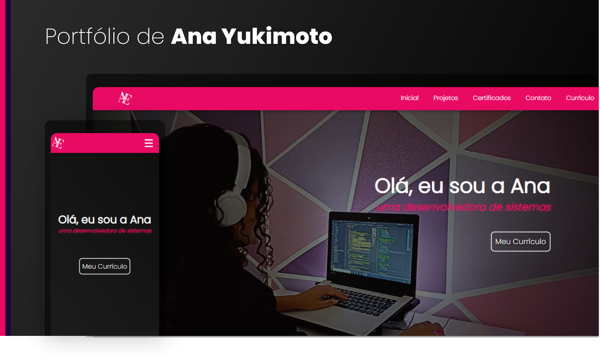

# Portfólio de Ana Yukimoto

Bem-vindo ao meu portfólio! Este é um espaço onde compartilho meus projetos, currículo e informações de contato. Meu portfólio está em constante desenvolvimento e reflete meu crescimento profissional e habilidades técnicas.

## Cores Base

- Cor Preto:  `#303841`
- Cor Rosa:  `#e90a63`
- Cor Roxa:  `#1c023b`

As cores base do meu portfólio são preto e rosa, refletindo minha personalidade e estilo. Essas cores são usadas para transmitir uma sensação de elegância, modernidade e criatividade em todo o meu portfólio.

## Conteúdo do Portfólio

- **Projetos:** Explore uma variedade de projetos nos quais tenho trabalhado. Cada projeto é uma oportunidade para aprender, experimentar e crescer como profissional.
- **Currículo:** Saiba mais sobre minha experiência profissional, habilidades técnicas e educacionais.
- **Contato:** Entre em contato comigo para oportunidades de colaboração, dúvidas ou apenas para dizer olá!

## Certificados

No futuro, planejo incluir certificados e conquistas relevantes neste portfólio. Fique atento para atualizações!

## Captura de Tela do Portfólio

## Acesso ao Portfólio

Você pode acessar meu portfólio [aqui](https://anayukimoto.github.io/). Sinta-se à vontade para explorar e deixar seus comentários ou sugestões. Se você gostar do que viu, não hesite em entrar em contato!

Este portfólio é uma representação do meu trabalho e dedicação ao longo do tempo. Estou sempre procurando melhorar e expandir minhas habilidades, então volte sempre para ver as últimas atualizações.

Obrigada por visitar meu portfólio!

---
Ana Yukimoto
